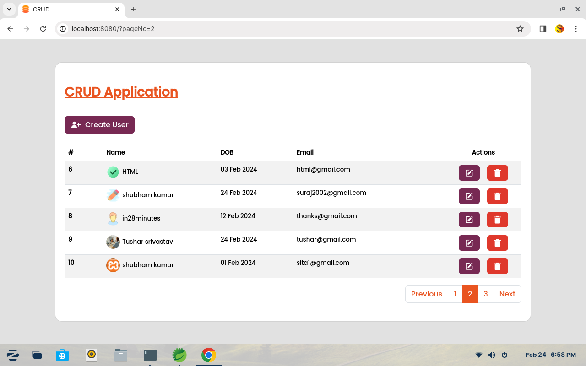
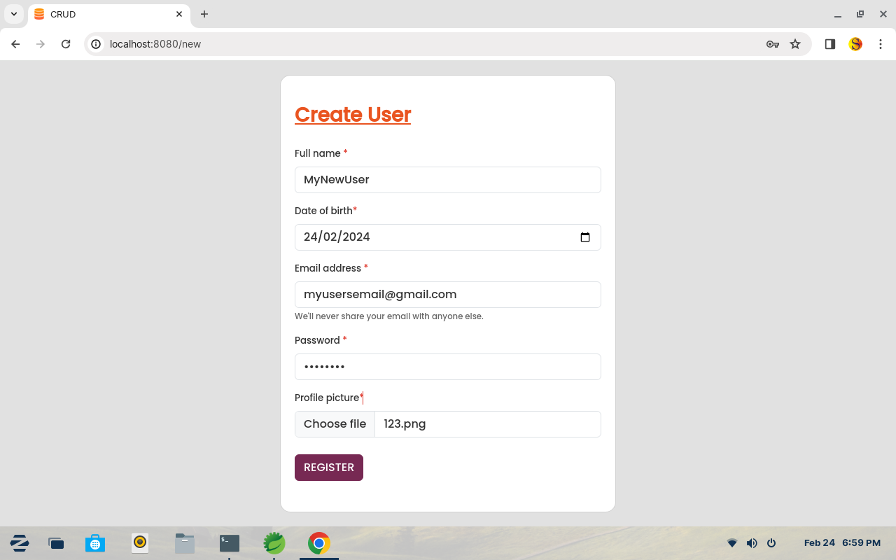
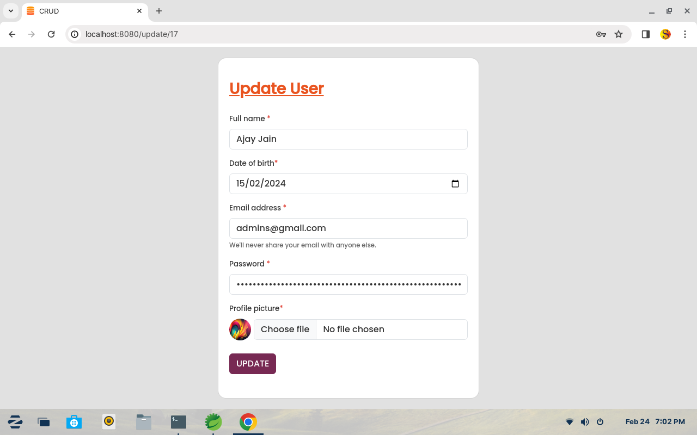
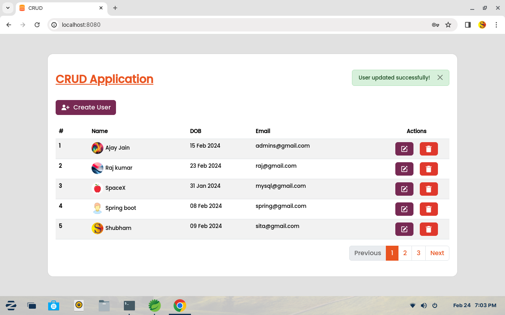

## crud-spring-boot-thymeleaf
 Simple crud application to perform basic tasks, that we have to know while learning spring boot.Best practice for beginners.

## Features
  1. Image Uplaod
  2. Password encoder
  3. Pagination links 
  4. Flash messages
  5. Error pages to handle error code such as 404, 500 etc.

## Technolgies Used 
  1. Spring-boot 3.0.0
  2. Thymeleaf template engine
  3. Spring data jpa
  4. Spring mvc
  5. MySQL database
  6. Developed in SpringToolSuite4 (STS) IDE
  
## Screenshots

<div style="display: flex;flex-direction: column; grid-gap: 10px;">
    <div style="display: flex; grid-gap: 10px;">
        
        
    </div>
    <div style="display: flex; grid-gap: 10px;">
        
        
    </div>
     <div style="display: flex; grid-gap: 10px;">
        
        
    </div>
</div>
<br>

## HOW TO USE?

 <b>Step-1:</b> Fistly you need to set-up your database. Make sure you have MySQL installed in your PC. 
 <br> Database Setup : to setup your database you can use the file database/boot_crud_db.sql. using phpmyadmin = if you are using php myadmin then simpley create a new database with the name of 'chat' and then you can import file database/boot_crud_db.sql from your import tab.

 using mysql command line client OR workbench - 
  you can simple run the given queries to create your database setup: 
    
  creating a database :
    
```sql
CREATE DATABASE boot_crud_db;
```

  using the database :

```sql
USE boot_crud_db;
```

  creating database table :

```sql
CREATE TABLE `users` (
  `id` bigint(20) NOT NULL,
  `dob` date DEFAULT NULL,
  `email` varchar(255) DEFAULT NULL,
  `name` varchar(255) DEFAULT NULL,
  `password` varchar(255) DEFAULT NULL,
  `image` varchar(255) DEFAULT NULL
) ENGINE=InnoDB DEFAULT CHARSET=latin1 COLLATE=latin1_swedish_ci;
```

  add primary key and other constraints :

```sql
ALTER TABLE `users`
  ADD PRIMARY KEY (`id`),
  ADD UNIQUE KEY `UK6dotkott2kjsp8vw4d0m25fb7` (`email`);
```
  set the unique id to handle big requests as well:

```sql
ALTER TABLE `users`
  MODIFY `id` bigint(20) NOT NULL AUTO_INCREMENT, AUTO_INCREMENT=40;
COMMIT;
```
dummy data:

```sql
INSERT INTO `users` (`id`, `dob`, `email`, `name`, `password`, `image`) VALUES
(20, '2024-02-23', 'raj@gmail.com', 'Raj kumar', '$2a$10$NI5IFvnLxpXlkjSplgsB2e2bOjHkEHtCZ7kfVzdRDPTVpJk9WH.Iu', 'cfb47473-369c-4be9-b3d0-a2bdbcdcfe38.jpg'),
(21, '2024-01-31', 'mysql@gmail.com', 'SpaceX', '$2a$10$9Oal.rc7J/0qewwsPbFOIuNgjTNGMRE2Zh1nxmY0CRTsiEK1IFRFO', 'adefefb9-b7c6-43d6-a661-c4a1ae42cc53.png');
```

 <b>Step-2:</b> open your STS IDE import this project as an existing maven project <br>
        <i>file->import->existing maven project-> choose project folder and hit enter</i><br><br>
        This will open that project in your ide<br><br>
 <b>Step-3:</b> To run this application firstly you need to update your build and update your newly opened maven project.<br>
        To do this right click on your project -> build project <br>
        after this in order to update your maven project, again<i> right click on your project-> maven -> update project</i><br><br>
 <b>Step-4:</b> Now you are ready to run this crud-application <br>
<i>right click on this java class => src/main/java/com/crudapp/SpringBootCrudApplication.java  -> Run As -> Spring boot application</i> <br>
It will take few seconds to launch the applications. after launching you can browser this url [ [http://localhost:8080](http://localhost:8080)] on your browser to show application  
<br><br>
<b>NOTE -</b> if you are configuring this type of project first time, you may face many errors, my suggestion is - to run application - and check the browser with this URL [ [http://localhost:8080](http://localhost:8080)] . If this page is available that means your errors are minor and you are able to run this applicaton 
<br>In my case this is working just fine!

## Contributing

Pull requests are welcome. For major changes, please open an issue first
to discuss what you would like to change.

Please make sure to update tests as appropriate.


